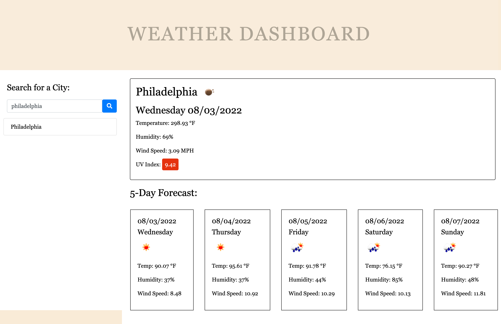

# weather-dashboard-thirdpaty-api

## Description

A simple interfaced weather dashboard with form inputs and feautures a dynamically updated HTML, CSS and Javascript. It allows the user to view current weather and 5-day weather prediction in various cities.

[OpenWeather API](https://openweathermap.org/api) is used to retrieve weather data for cities. And `localStorage` is used to store persistent data.

## Functionality

* When searching for a city, the current and future conditions for that city will be presented and that city is added to the search history using Local Storage.
  
* When viewing current weather conditions for the city, the following is shown:
  * City name
  * Date
  * Day
  * An icon representation of weather conditions
  * Temperature
  * Humidity
  * Wind speed
  * UV index

* UV index is classified in severity using the following color schemes:
(reference: [Ultraviolet Index Wikipeadia](https://en.wikipedia.org/wiki/Ultraviolet_index#:~:text=A%20UV%20index%20reading%20of,broad%20spectrum%20SPF%2030%2B%20sunscreen.&text=A%20UV%20index%20reading%20of%206%20to%207%20means%20high,harm%20from%20unprotected%20sun%20exposure.))
  *  0-2 Low
  *  3-5 Moderate
  *  6-7 Orange
  *  8-10 Very High
  *  11+ Extreme

* When viewing the future weather conditions for the city, a 5-day forecast will be presented with the following information:
  * Date
  * Day
  * An icon representation of weather conditions
  * Temperature
  * Humidity
  
* When a city in the search history is clicked, the current and future conditions for that city is presented again
* When the weather dashboard is opened, the last searched city forecast is presented
  
## Features

* HTML
* CSS
* Bootstrap
* Moment.js
* Server-Side API - OpenWeather API

## GitHub Repo
https://github.com/Summerjay0401/weather-dashboard-thirdparty-api

## GitHub Pages
https://summerjay0401.github.io/weather-dashboard-thirdparty-api/

## SCREENSHOT

## DEMO

- - -

By Summer Jade Rosal